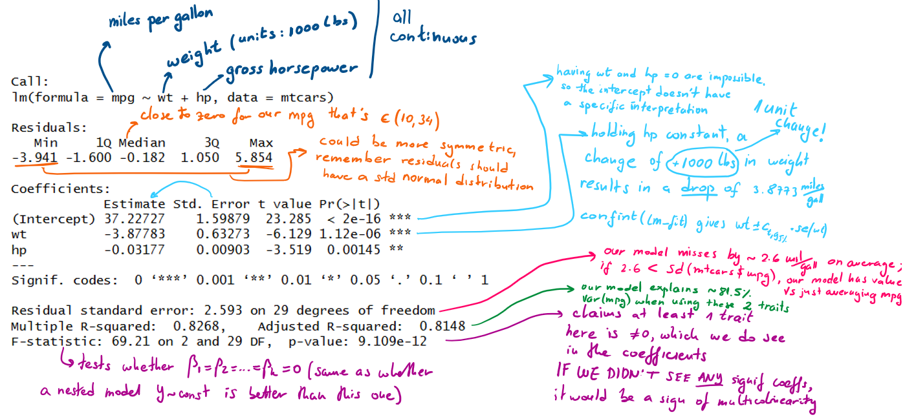

The report depends on what type your data is and whether it was scaled (affects 
interpreting coefficients and changes in your outcome), as well as
whether your goal is predictions or variable interpretation (affects whether you
care about having a "good" model seen by high adj $R^2$ and significant F-statistic, 
but no significant predictors, or if you care about what is mostly contributing
to the outcome's variance).  
Overall, you should present both the contextualised importance of your findings
and the numbers (unstandardised regression coefficients, standardised if makes sense,
standard errors, t values, rResidual standard error, residual df, adjusted $R^2$ 
if multivariable, CIs and p-values).  
All examples here assume you have been through the assessment of your linear model
and are happy with it.

::: {.panel-tabset}


## Continuous, no scaling

```{r, echo = FALSE, include=FALSE}
#| label: library_setup
suppressMessages(library(tidyverse))
```


```{r, eval = FALSE}
#| label: all_cont_no_scaling
summary(lm(mpg ~ wt + hp, data = mtcars))
```


-  increasing the weight by 1000 lbs would result in a drop of 3.8773 miles/gallon i.e. one unit change of weight results in a drop of 3.8773 miles/gallon
-  an increase in 1 horsepower (gross) would result in a drop of 0.03177 miles/gallon i.e. an increase in 100 horsepower (gross) would result in a drop of 3.177 miles/gallon 
-  the typical prediction would be off by ~2.6 miles/gallon
-  the model explains ~81.48% of the variation of miles/gallon, i.e. the adjusted $R^2$ = 0.8148

## Mixed, no scaling

### Binary 
It's common to have some sort of binary in your predictors, like sex. If it is
encoded as 0 and 1, R handles it regardless whether it is a factor or numerical,
and the interpretation of its coefficient holds the same in both cases, just different 
naming, so it is instantly clear which level represented by the coefficient.
The underlying equation is $mpg = \beta_0 +  \beta_1*wt + \beta_2*hp + \beta_3*I(vs == 1)$, 
where $I()$ is an indicator function, returning 1 when the expression is true,
so the reference is the '0' group. In this case vs = 0 means engine is v-shaped,
whilst vs = 1 means straight, as long as the levels match the labeled values!

**Note:** This also holds when it is any 2 integer values that *differ by 1*, factor
or not (e.g. 1,2 or 4,5). If they do not differ by 1, it **has** to be a factor to be 
treated as a categorical binary (i.e. representing two categories)

```{r}
#| label: mixed_binary_no_scaling

summary(lm(mpg ~ wt + hp + vs, data = mtcars))
# "factored" vs, notice vs_f became vs_f1 as a variable, meaning the reference 
# is vs_f0 i.e. the 0 group
mtcars_f <- mtcars %>% dplyr::mutate(vs_f = as.factor(vs))
summary(lm(mpg ~ wt + hp + vs_f, data = mtcars_f))

```
(Imagine vs is also significant and it makes sense for it to be in the model):
-  increasing the weight by 1000 lbs would result in a drop of 3.78003 miles/gallon i.e. one unit change of weight results in a drop of 3.78003 miles/gallon
-  an increase in 1 horsepower (gross) would result in a drop of 0.02542 miles/gallon i.e. an increase in 100 horsepower (gross) would result in a drop of 2.542 miles/gallon 
-  a straight engine (group 1) has a higher mpg by 1.36771 than v-shaped engines
-  the typical prediction would be off by ~2.6 miles/gallon
-  the model explains ~81.5% of the variation of miles/gallon, i.e. the adjusted $R^2$ = 0.815


### Categorical
Let's say a variable has more than 2 levels, e.g. in this dataset, cars can have
4,6, or 8 cylinders. Let's call each a category (you can make categories by binning 
the values you have e.g.). This adds k-1 dummy variables to the model, where k is
the amount of categories, making the model:
$mpg = \beta_0 + \beta_1*wt + \beta_2*hp + \beta_3*I(cyl\_f == 6) + \beta_4*I(cyl\_f == 8)$, 

```{r}
#| label: mixed_categ_no_scaling

mtcars_f <- mtcars %>% dplyr::mutate(cyl_f = as.factor(cyl))
summary(lm(mpg ~ wt + hp + cyl_f, data = mtcars_f))

```
-  increasing the weight by 1000 lbs would result in a drop of 3.18140 miles/gallon i.e. one unit change of weight results in a drop of 3.18140 miles/gallon
-  an increase in 1 horsepower (gross) would result in a drop of 0.02312 miles/gallon i.e. an increase in 100 horsepower (gross) would result in a drop of 2.312  miles/gallon 
-  our reference group is `cyl=4`, for us meaning 4 cylinders, so our `cyl=6` group has a lower mpg by 3.35902
-  our `cyl=8` group has a lower mpg than `cyl=4` by 3.18588, although it is not significantly diff from 0 difference
-  the typical prediction would be off by 2.44 miles/gallon
-  the model explains ~83.6% of the variation of miles/gallon, i.e. the adjusted $R^2$ = 0.8361

## Scaling

The term standardised coefficients refers to coefficients that have been standardised 
so as to make them comparable with each other (due to different magnitudes and units 
of independent variables), giving you the information which independent 
variables explain the dependent variable more. The values are between −1 and +1 
and the larger the value, the greater the contribution of the independent variable
to explaining the dependent variable. This doesn't differ between continuous and
categorical variables.
Another interpretation we get from that is changes per standard deviations instead
of per unit changes, for both the outcome and predictor. 

The way to standardise coefficients is either run the model with every variable 
(dependent and independent!) as scaled (mean 0, std 1), or, on each unstandardised coefficient,
multiply it by its variable standard deviation and divide by the outcomes standard 
deviation from the dataset that is *used* in the model.

**Note on standardising categorical vars**: you physically can't run scaling on
a factor, it has to be numerical for that to happen, so if you have a binary, turn
the data into 0s and 1s, and if you have a categorical, make the dummy numerical 
binaries that would be in your model (k-1 of them, excludes reference group!)  
You could also do the standardisation manually, but still requires making the
dummy variables to, at the very least, extract the sd

There is no intercept when coeffs are standardised!

```{r}
#| label: scaling

lm_unstd <- lm(mpg ~ wt + hp + vs, data = mtcars)
summary(lm_unstd)

# requires you to have everything numerical in the data
QuantPsyc::lm.beta(lm_unstd)

# another way to reach them:
coef(lm_unstd)[c("wt", "hp", "vs")]*c(purrr::map_dbl(list(mtcars$wt, mtcars$hp, mtcars$vs), sd))/sd(mtcars$mpg)
```

-  We see wt has the most influence on mpg (decreases, but highest impact)
-  With one std deviation change of wt (sd(wt) = 0.9784574 * 1000 lbs = 978 lbs),
we get a 0.61 std deviation decrease in mpg (sd(mtcars$mpg) = 6.02) 
- with binary variables, you can only claim the amount of influence it has, since
a std of a binary isn't interpretable    


```{r}
#| label: scaling_interpretation

# For interpreting changes:
one_std_change_wt <- coef(lm_unstd)["wt"]*(1+sd(mtcars$wt)) + coef(lm_unstd)["hp"]*1 + coef(lm_unstd)["vs"]*1
an_instance <-  coef(lm_unstd)["wt"]*1 + coef(lm_unstd)["hp"]*1 + coef(lm_unstd)["vs"]*1
  
all.equal(one_std_change_wt - an_instance, QuantPsyc::lm.beta(lm_unstd)["wt"] * sd(mtcars$mpg))
```

## Categorical, no scaling
Practically the same as mixed and no scaling.
Here we have genetic data. We will examine the association of the actn3_r577x SNP
with the percentage change in strength of the non-dominant arm before and after 
exercise (NDRM.CH). The research team believes that the effect of genotype on our
trait might differ between males and females, and we can examine this by including
the Gender variable in our analysis.

```{r}
#| label: categorical_no_scaling

fms <- read.delim("../../data/FAMuSS_data.txt", header = TRUE, sep = "\t")
lm.fit <- lm(NDRM.CH ~ factor(actn3_r577x) + factor(Gender), data = fms)
summary(lm.fit)
```
-  the genotype is treated as two binary variables that compare the CT and TT genotypes
with the CC genotype (treated as the baseline). 
-  for Gender, Female is treated as the baseline so factor(Gender)Male measures the
difference between males and females. 
-  the regression model that is specified in R as NDRM.CH ~ factor(actn3_r577x) + factor(Gender) 
can be written mathematically as:
$Y=β_0+β_1I(actn3\_r577x=CT)+β_2I(actn3\_r577x=TT)+β_3I(Gender=Male)+ϵ$
where Y is the outcome, $β_0$ is the estimated mean value of the trait for females
with the CC genotype
-  the average percentage change in the non-dominant
arm muscle strength is estimated at 57.409 for females with homozygous CC genotype
-  the effect in females of having the heterozygous CT genotype compared with CC is
estimated to be 5.787, but this is not significantly different from zero at $α = 0.05$.
-  the effect of TT genotype is estimated to be nearly twice as large (9.9), and is significant
-  for CC genotype males, the estimated percentage change in the non-dominant arm 
muscle strength is 57.409 − 23.472
-  because interaction between gender and genotype is not included in the model, 
we assume that the effect of genotype on the mean response is the **same in males** 
as in females, with the CT and TT mean response estimated to be 5.787 and 9.967 
higher than for the CC genotype.

## "Logged" values

### Only dependent variable is log-transformed
$$E(V|x) = E(log(Y)|x) = \beta_0 + \sum_{j=1}^k\beta_jg_{j}(x)$$
For one unit change of trait j, it will result in one unit change of V, however 
you are usually interested in the change in Y, as that is your measured trait.  
One unit change of trait j results in $ (e^{\beta_j} - 1)*100\% $ percent difference
(in **geometric mean**) of Y. See math proof below for more information.

### Some independent variables are log-transformed
E.g. $Y=β_0+β_1x_1+β_2log(x_2)+β_3log(x_3)+ϵ$

Let's say we have $x_3$ be $r_1$, and it changes to $r_2$:

The effects of the log transformed traits are still linear, so  $E(Y|r_2) -  E(Y|r_1) = \beta_3 \times [ \log(r_2) – \log(r_1) ] = \beta_3 \times [\log(r_2 / r_1)]$;  
Reporting this would be e.g. a 1% increase in x_3 leads to $log1.01 \times \beta_3$ unit increase in $Y \rightarrow$ which can be approximated (because it's a small change) by $0.01*\beta_3 \text{ or } \frac{\beta_3}{100}$

### Dependent and some independent are log-transformed
The situation we haven't covered yet is reporting an increase in a log-transformed
independent for a log-trans dependent.

$$ E(log(Y)|r_2) -  E(log(Y)|r_1) = \beta_3 \times [ \log(r_2) – \log(r_1) ] = \beta_3 \times [\log(r_2 / r_1)] \iff \\
\frac{e^{E(log(Y)|\mathbf{x_j})}}{e^{E(log(Y)|\mathbf{x})}} = e^{log((\frac{r_2}{r_1})^{\beta_3})}  \iff \frac{GeomMean(Y|\mathbf{x_j})}{GeomMean(Y|\mathbf{x})}= (\frac{r_2}{r_1})^{\beta_3}
$$
So for a 1% increase in x_3 leads to $(1.01^{\beta_3}-1)*100\%$ percent change in $Y \rightarrow$ which can be approximated (because it's a small change) by $0.01*\beta_3 * 100 \% = \beta_3 \%$


### Math proof:
You want a function of Y, not of logY:   
$$ \mathbf{x} - realisation~of~predictors \\ 
\mathbf{x_j} - realisation~of~predictors~ like~ \mathbf{x}~ where~ only~ x_j~ is~ increased~ by~ 1~ unit \\ E(log(Y)|\mathbf{x_j}) -  E(log(Y)|\mathbf{x}) = \beta_j \iff e^{E(log(Y)|\mathbf{x_j}) -  E(log(Y)|\mathbf{x})} = e^{\beta_j} \iff \frac{e^{E(log(Y)|\mathbf{x_j})}}{e^{E(log(Y)|\mathbf{x})}} = e^{\beta_j}  \iff \frac{GeomMean(Y|\mathbf{x_j})}{GeomMean(Y|\mathbf{x})}= e^{\beta_j} $$
Taking the exponent of the average log is the definition of a geometric mean:
$$ e^{E(logY|x)} = e^{\frac{1}{n}(log(y_1) + .. +log(y_n))} = e^{\frac{1}{n}(log(y_1*..*y_n))} = e^{log((y_1*..*y_n)^\frac{1}{n})} = (y_1*..*y_n)^\frac{1}{n} \rightarrow geometric~mean$$

:::
