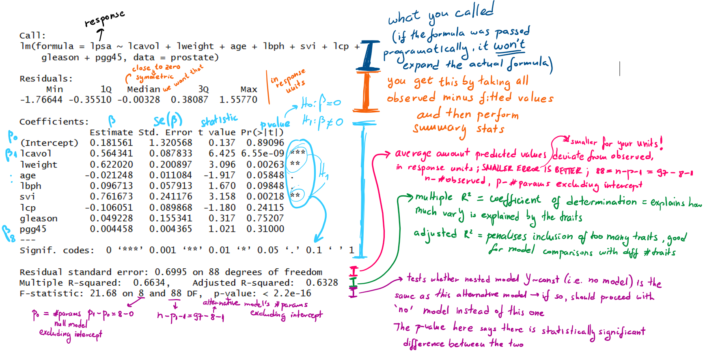

## TL;DR
-  Check sample size >= 10*num of predictors
-  Do three diagnostics seen in <a href="#" onclick="goToTab('tabset-1-3-tab'); return false;">When CAN I?</a>
-  Optional: check multicollinearity using car::vif(lm_output) >=10 if you care about variable interpretation and contribution (not prediction)
-  Check manual and adjusted $R^2>>0$
-  Check the residuals summary has a median close to zero (in units of response var) 
-  Check residual standard error is small for the units and mean of your response variable 
-  Continue looking at traits by following <a href="#" onclick="goToTab('tabset-1-5-tab'); return false;">How to interpret?</a>   
-  When you're happy with the selected traits, report, use the guide example in <a href="#" onclick="goToTab('tabset-1-6-tab'); return false;">Reporting</a>   

The regression of $Y$ on $x$ is the conditional mean $E(Y|x) = m(x)$, where $m(x)$ can take any form,
but in a linear regression, it takes this form: $$\begin{gather} E(Y|x) = m(x) = \beta_0 + \sum_{j=1}^k \beta_jg_{j}(x) \text{ and } \\ var(Y|x) = \sigma^2 \end{gather}$$ where $\beta_j$ are the coefficients.
Performing a regression means estimating $\beta_j, ~ j = 0,..,k$. 

## Guide

::: {.panel-tabset}

## Common phrases 
### Common phrases associated with linear regression
-  Regression in the dictionary means "a return to a former state"
-  The sentence "regression to the mean" means if a variable is extreme on its 
first measurement, it will tend to be closer to the average on its second measurement
and vice versa 
-  Linear actually means linear in the coefficients, i.e. not necessarily a straight
line but a linear combination (i.e an additive function) of complex and non-linear
functions of x, with the coefficients 'out the front'  
-  Additive function f is such that this holds $$ f_{v_1+v_2}(x) = f_{v_1}(x) + f_{v_2}(x), \text{ and} \\ f_{c*v_1}(x) = c*f_{v_1}(x) $$ where $$ v_1 = (\beta_0, \beta_1, ..., \beta_k), ~ v_2 = (\alpha_0, \alpha_1, ..., \alpha_k)$$ i.e. the coefficients of $f(x)$. See <a href="#" onclick="goToTab('tabset-1-9-tab'); return false;">Maths</a> for proof this holds for $E(Y|x) = m(x) = \beta_0 + \sum_{j=1}^k \beta_jg_{j}(x)$


## When?
### When do I use a linear regression?
(a.k.a what question do I need answering so that the answer is "use a lin regression for that"?)  

-  you are interested in inferring a relationship between a variable/trait Y and a (vector of)
variable/trait(s)    
-  you are interested in predicting Y based on a new value of the variable/trait(s)    

This explanation leads to treating Y as a random variable and x as the known. 
Y is modelled as a **deterministic** function $m(x)$ plus a mean-zero noise term i.e. 
the observation $(x_i, Y_i)$ satisfies $Y_i = m(x_i) + \epsilon_i$, where for all $i$, 
$\epsilon_i$ are independent, $E(\epsilon_i)=0$ and $var(\epsilon_i)= \sigma^2$.

::: {.callout-note}
If $var(\epsilon_i)= \sigma_i^2$, it's called heteroscedasticity, handling this TBA
:::

## When CAN I? {#sec-when-can}
### When CAN I use this, what needs to hold up for me to even think about using it? 
We have to check the assumptions hold. The assumptions are:  
1)  linear model for the mean, i.e. $E(Y|x) = m(x)$ is linear  
2)  $var(\epsilon_i)= \sigma^2$ i.e. var is the same for all $i$  
3)  the residue (error, noise) normality assumption of $\epsilon_i \sim N(0, \sigma^2)$  we have to introduce if we would like to know how well our coefficients are estimated (for CIs and testing hypotheses like whether the coeffs differ from 0 i.e. where Y is varying of x)  

To check these assumptions, you need to fit the model first, and then check the assumptions.
For each assumption you do:  
1) Plot **observed** vs fitted values (each data point is described by the observed
$Y_i$ and by the value $m(x_i)$ you have come to i.e. the value on your estimated line), 
you are hoping to see points scattered randomly along the diagonal line of y = x  
2) Plot **residuals** vs fitted values (each data point is described by the residual - observed 
$Y_i$ minus $m(x_i)$ - and $m(x_i)$), you are hoping to see an equal amount of points above and below 0 at similar distances from 0 and spread across the x axis (if that is not the case, plotting 
residuals vs. a specific independent variable tells you which specific variable 
needs to be "fixed" e.g., if you see a curve here, you need to add a squared term
of this specific variable)
3) plot a normal QQ plot of the residuals to check whether the distribution of residuals
is $\sim N(0, \sigma^2)$ - you're hoping to see all the points on the diagonal   

Note: each $Y_i$ depends on $x_i$, the normality assumption is per $x_i$

```{r}
#| label: lm_diagnostics

load(url("https://github.com/cran/ElemStatLearn/raw/refs/heads/master/data/prostate.RData"))


lm1 <- lm(lpsa ~ lcavol + lweight + age + lbph + svi + lcp + gleason + pgg45, data = prostate)

# looking at 1)
plot(fitted(lm1), prostate$lpsa, xlab = "Fitted", ylab = "Observed")
abline(0,1)

# looking at 2)
plot(fitted(lm1), residuals(lm1), xlab = "Fitted", ylab = "Residuals")
abline(h = 0)
# I personally like this built-in version of fitted vs observables more, due to
# the fitted curve, you'd want it to follow y = 0 as much as possible (not easy
# when you have a smaller dataset, then it might be distracting)
plot(lm1, 1:1)

# looking at 3)
# Q-Q plots compare quantiles of the observed data to the quantiles of your theoretical distribution
# qqnorm compares to N(0,1)
qqnorm(residuals(lm1))
# default distribution based on which the line is drawn is N(0,1)
# it's just a line that draws through the 1st and 3rd quantile (because we believe
# that all the points from our data coincide with data points in this distribution, 
# then so do the quantiles in our data and the theoretical quantiles, and we choose
# to make a line through those, so that they are not favoured by a different mean/outliers)
qqline(residuals(lm1))
```
If you care about interpretation of the predictors in this model, you need to check 
whether there is multicollinearity between the predictors. If any of the predictor's
variance inflation factor is over 10, the more likely multicollinearity is present 
and that predictor(s) should be dropped -> that decision should be based on more
investigation, like pairwise correlation, domain knowledge and/or with a usage of
Lasso or Ridge regression.

```{r}
#| label: lm_multicollinearity

car::vif(lm1)

```

## How to assess?
### How to assess if my lin model is likely a lin model?
Apart from doing everything in <a href="#" onclick="goToTab('tabset-1-3-tab'); return false;">When CAN I?</a>, especially 1), there is also:  
-  The residuals summary should have a median around 0 in your reponses's units, otherwise
it might indicate your model is misspecified (should be confirmed with Q-Q plot)  
-  $R^2$, which is the coefficient of determination, measures the strength of the linear relationship
between the traits and outcome and is between 0 and 1 i.e. the proportion of varY
that is explained by your estimated m(x); an $R^2>>0$ indicates a closer fit of 
the model to the data, and the adjusted $R^2$ takes into account irrelevant predictors   
-  The Residual standard error should be small, close to 0 in your response's units   
-  Overall p-value of the F-statistic test should tell you it's a better model than no model

The output:
 

## How to interpret? {#sec-interpret-lin}  
### How to interpret it once I know it's a likely a lin model?
Normally you want to see whether the trait(s) are in a relationship with $Y$, and
you would do so by testing whether the coefficients next to those traits are 
statistically significantly different from 0. 

```{r}
#| label: lm_summary

lm1 <- lm(lpsa ~ lcavol + lweight + age + lbph + svi + lcp + gleason + pgg45, data = prostate)
summary(lm1)

```

If some coefficients are not so different from 0, you might want to consider 
a simpler model without these traits included, and test whether the two nested
models are the same, and then proceed with the simpler one (o/w if they are 
significantly different, proceed with the more complex model) - see Anova in testing TBA

Whether the intercept is significantly different from 0 or not matters for whatever
your model represents i.e. the state of the outcome when all of your traits are
0 -> I would use this as a reality check


## Reporting   


The report depends on what type your data is and whether it was scaled (affects 
interpreting coefficients and changes in your outcome), as well as
whether your goal is predictions or variable interpretation (affects whether you
care about having a "good" model seen by high adj $R^2$ and significant F-statistic, 
but no significant predictors, or if you care about what is mostly contributing
to the outcome's variance).  
Overall, you should present both the contextualised importance of your findings
and the numbers (unstandardised regression coefficients, standardised if makes sense,
standard errors, t values, rResidual standard error, residual df, adjusted $R^2$ 
if multivariable, CIs and p-values).  
All examples here assume you have been through the assessment of your linear model
and are happy with it.  
For now, outcomes are continuous and the tabs talk about predictors

### Continuous, no scaling

```{r, echo = FALSE, include=FALSE}
#| label: library_setup
suppressMessages(library(tidyverse))
```


```{r, eval = FALSE}
#| label: all_cont_no_scaling
summary(lm(mpg ~ wt + hp, data = mtcars))
```


-  increasing the weight by 1000 lbs would result in a drop of 3.8773 miles/gallon i.e. one unit change of weight results in a drop of 3.8773 miles/gallon
-  an increase in 1 horsepower (gross) would result in a drop of 0.03177 miles/gallon i.e. an increase in 100 horsepower (gross) would result in a drop of 3.177 miles/gallon 
-  the typical prediction would be off by ~2.6 miles/gallon
-  the model explains ~81.48% of the variation of miles/gallon, i.e. the adjusted $R^2$ = 0.8148

### Mixed, no scaling

#### Binary 
It's common to have some sort of binary in your predictors, like sex. If it is
encoded as 0 and 1, R handles it regardless whether it is a factor or numerical,
and the interpretation of its coefficient holds the same in both cases, just different 
naming, so it is instantly clear which level represented by the coefficient.
The underlying equation is $mpg = \beta_0 +  \beta_1*wt + \beta_2*hp + \beta_3*I(vs == 1)$, 
where $I()$ is an indicator function, returning 1 when the expression is true,
so the reference is the '0' group. In this case vs = 0 means engine is v-shaped,
whilst vs = 1 means straight, as long as the levels match the labeled values!

**Note:** This also holds when it is any 2 integer values that *differ by 1*, factor
or not (e.g. 1,2 or 4,5). If they do not differ by 1, it **has** to be a factor to be 
treated as a categorical binary (i.e. representing two categories)

```{r}
#| label: mixed_binary_no_scaling

summary(lm(mpg ~ wt + hp + vs, data = mtcars))
# "factored" vs, notice vs_f became vs_f1 as a variable, meaning the reference 
# is vs_f0 i.e. the 0 group
mtcars_f <- mtcars %>% dplyr::mutate(vs_f = as.factor(vs))
summary(lm(mpg ~ wt + hp + vs_f, data = mtcars_f))

```
(Imagine vs is also significant and it makes sense for it to be in the model):
-  increasing the weight by 1000 lbs would result in a drop of 3.78003 miles/gallon i.e. one unit change of weight results in a drop of 3.78003 miles/gallon
-  an increase in 1 horsepower (gross) would result in a drop of 0.02542 miles/gallon i.e. an increase in 100 horsepower (gross) would result in a drop of 2.542 miles/gallon 
-  a straight engine (group 1) has a higher mpg by 1.36771 than v-shaped engines
-  the typical prediction would be off by ~2.6 miles/gallon
-  the model explains ~81.5% of the variation of miles/gallon, i.e. the adjusted $R^2$ = 0.815


#### Categorical
Let's say a variable has more than 2 levels, e.g. in this dataset, cars can have
4,6, or 8 cylinders. Let's call each a category (you can make categories by binning 
the values you have e.g.). This adds k-1 dummy variables to the model, where k is
the amount of categories, making the model:
$mpg = \beta_0 + \beta_1*wt + \beta_2*hp + \beta_3*I(cyl\_f == 6) + \beta_4*I(cyl\_f == 8)$, 

```{r}
#| label: mixed_categ_no_scaling

mtcars_f <- mtcars %>% dplyr::mutate(cyl_f = as.factor(cyl))
summary(lm(mpg ~ wt + hp + cyl_f, data = mtcars_f))

```
-  increasing the weight by 1000 lbs would result in a drop of 3.18140 miles/gallon i.e. one unit change of weight results in a drop of 3.18140 miles/gallon
-  an increase in 1 horsepower (gross) would result in a drop of 0.02312 miles/gallon i.e. an increase in 100 horsepower (gross) would result in a drop of 2.312  miles/gallon 
-  our reference group is `cyl=4`, for us meaning 4 cylinders, so our `cyl=6` group has a lower mpg by 3.35902
-  our `cyl=8` group has a lower mpg than `cyl=4` by 3.18588, although it is not significantly diff from 0 difference
-  the typical prediction would be off by 2.44 miles/gallon
-  the model explains ~83.6% of the variation of miles/gallon, i.e. the adjusted $R^2$ = 0.8361


### Scaling

The term standardised coefficients refers to coefficients that have been standardised 
so as to make them comparable with each other (due to different magnitudes and units 
of independent variables), giving you the information which independent 
variables explain the dependent variable more. The values are between −1 and +1 
and the larger the value, the greater the contribution of the independent variable
to explaining the dependent variable. This doesn't differ between continuous and
categorical variables.
Another interpretation we get from that is changes per standard deviations instead
of per unit changes, for both the outcome and predictor. 

The way to standardise coefficients is either run the model with every variable 
(dependent and independent!) as scaled (mean 0, std 1), or, on each unstandardised coefficient,
multiply it by its variable standard deviation and divide by the outcomes standard 
deviation from the dataset that is *used* in the model.

**Note on standardising categorical vars**: you physically can't run scaling on
a factor, it has to be numerical for that to happen, so if you have a binary, turn
the data into 0s and 1s, and if you have a categorical, make the dummy numerical 
binaries that would be in your model (k-1 of them, excludes reference group!)  
You could also do the standardisation manually, but still requires making the
dummy variables to, at the very least, extract the sd

There is no intercept when coeffs are standardised!

```{r}
#| label: scaling

lm_unstd <- lm(mpg ~ wt + hp + vs, data = mtcars)
summary(lm_unstd)

# requires you to have everything numerical in the data
QuantPsyc::lm.beta(lm_unstd)

# another way to reach them:
coef(lm_unstd)[c("wt", "hp", "vs")]*c(purrr::map_dbl(list(mtcars$wt, mtcars$hp, mtcars$vs), sd))/sd(mtcars$mpg)
```

-  We see wt has the most influence on mpg (decreases, but highest impact)
-  With one std deviation change of wt (sd(wt) = 0.9784574 * 1000 lbs = 978 lbs),
we get a 0.61 std deviation decrease in mpg (sd(mtcars$mpg) = 6.02) 
- with binary variables, you can only claim the amount of influence it has, since
a std of a binary isn't interpretable    


```{r}
#| label: scaling_interpretation

# For interpreting changes:
one_std_change_wt <- coef(lm_unstd)["wt"]*(1+sd(mtcars$wt)) + coef(lm_unstd)["hp"]*1 + coef(lm_unstd)["vs"]*1
an_instance <-  coef(lm_unstd)["wt"]*1 + coef(lm_unstd)["hp"]*1 + coef(lm_unstd)["vs"]*1
  
all.equal(one_std_change_wt - an_instance, QuantPsyc::lm.beta(lm_unstd)["wt"] * sd(mtcars$mpg))
```

### Categorical, no scaling
Practically the same as mixed and no scaling.
Here we have genetic data. We will examine the association of the actn3_r577x SNP
with the percentage change in strength of the non-dominant arm before and after 
exercise (NDRM.CH). The research team believes that the effect of genotype on our
trait might differ between males and females, and we can examine this by including
the Gender variable in our analysis.

```{r}
#| label: categorical_no_scaling

fms <- read.delim("../../data/FAMuSS_data.txt", header = TRUE, sep = "\t")
lm.fit <- lm(NDRM.CH ~ factor(actn3_r577x) + factor(Gender), data = fms)
summary(lm.fit)
```
-  the genotype is treated as two binary variables that compare the CT and TT genotypes
with the CC genotype (treated as the baseline). 
-  for Gender, Female is treated as the baseline so factor(Gender)Male measures the
difference between males and females. 
-  the regression model that is specified in R as NDRM.CH ~ factor(actn3_r577x) + factor(Gender) 
can be written mathematically as:
$\small Y=β_0+β_1I(actn3\_r577x=CT)+β_2I(actn3\_r577x=TT)+β_3I(Gender=Male)+ϵ$
where Y is the outcome, $β_0$ is the estimated mean value of the trait for females
with the CC genotype
-  the average percentage change in the non-dominant
arm muscle strength is estimated at 57.409 for females with homozygous CC genotype
-  the effect in females of having the heterozygous CT genotype compared with CC is
estimated to be 5.787, but this is not significantly different from zero at $α = 0.05$.
-  the effect of TT genotype is estimated to be nearly twice as large (9.9), and is significant
-  for CC genotype males, the estimated percentage change in the non-dominant arm 
muscle strength is 57.409 − 23.472
-  because interaction between gender and genotype is not included in the model, 
we assume that the effect of genotype on the mean response is the **same in males** 
as in females, with the CT and TT mean response estimated to be 5.787 and 9.967 
higher than for the CC genotype.

### "Logged" values

#### Only dependent variable is log-transformed
$$E(V|x) = E(log(Y)|x) = \beta_0 + \sum_{j=1}^k\beta_jg_{j}(x)$$
For one unit change of trait j, it will result in one unit change of V, however 
you are usually interested in the change in Y, as that is your measured trait.  
One unit change of trait j results in $ (e^{\beta_j} - 1)*100\% $ percent difference
(in **geometric mean**) of Y. See math proof below for more information.

#### Some independent variables are log-transformed
E.g. $Y=β_0+β_1x_1+β_2\log(x_2)+β_3\log(x_3)+ϵ$

Let's say we have $x_3$ be $r_1$, and it changes to $r_2$:

The effects of the log transformed traits are still linear, so  $E(Y|r_2) -  E(Y|r_1) = \beta_3 \times [ \log(r_2) – \log(r_1) ] = \beta_3 \times [\log(r_2 / r_1)]$;  
Reporting this would be e.g. a 1% increase in x_3 leads to $log1.01 \times \beta_3$ unit increase in $Y \rightarrow$ which can be approximated (because it's a small change) by $0.01*\beta_3 \text{ or } \frac{\beta_3}{100}$

#### Dependent and some independent are log-transformed
The situation we haven't covered yet is reporting an increase in a log-transformed
independent for a log-trans dependent.

$$
\begin{gather}
E(\log(Y)|r_2) - E(\log(Y)|r_1) = \beta_3 \times [ \log(r_2) - \log(r_1) ] = \beta_3 \times [\log(r_2 / r_1)] \iff \\ 
\frac{e^{E(\log(Y)|r_2)}}{e^{E(\log(Y)|r_1)}} = e^{\log((\frac{r_2}{r_1})^{\beta_3})} \iff \frac{\text{GeomMean}(Y|r_2)}{\text{GeomMean}(Y|r_1)}= \left(\frac{r_2}{r_1}\right)^{\beta_3}
\end{gather}
$$

So for a 1% increase in x_3 leads to $(1.01^{\beta_3}-1)*100\%$ percent change in $Y \rightarrow$ which can be approximated (because it's a small change) by $0.01*\beta_3 * 100 \% = \beta_3 \%$


#### Math proof:
You want a function of Y, not of logY:   
$$
\begin{gather}
\mathbf{x} - \text{realisation of predictors} \\ 
\mathbf{x_j} - \text{realisation of predictors like } \mathbf{x} \text{ where only } x_j \text{ is increased by 1 unit}\\
E(log(Y)|\mathbf{x_j}) -  E(log(Y)|\mathbf{x}) = \beta_j \iff e^{E(log(Y)|\mathbf{x_j}) -  E(log(Y)|\mathbf{x})} = e^{\beta_j} \iff \\
 \frac{e^{E(log(Y)|\mathbf{x_j})}}{e^{E(log(Y)|\mathbf{x})}} = e^{\beta_j}  \iff \frac{GeomMean(Y|\mathbf{x_j})}{GeomMean(Y|\mathbf{x})}= e^{\beta_j}
\end{gather}
$$
Taking the exponent of the average log is the definition of a geometric mean:
$$ e^{E(logY|x)} = e^{\frac{1}{n}(log(y_1) + .. +log(y_n))} = e^{\frac{1}{n}(log(y_1*..*y_n))} = e^{log((y_1*..*y_n)^\frac{1}{n})} = (y_1*..*y_n)^\frac{1}{n} \rightarrow geometric~mean $$

### Changing from unit to percentile 

To report moving from the x^th^ to the y^th^ percentile:  
Calculate the value of your predictor at both percentiles, find the difference, 
and multiply that difference by the coefficient: 
$\beta _{\text{y-x}}=\beta _{\text{raw}}\times (q_{y\%,pred} - q_{x\%,pred})$

## R caveats/defaults 
### R caveats/defaults I need to know about?
- uses ordinary least squares which doesn't assume any distribution for $Y_i$
- implied intercept term unless you tell it otherwise
- Non-NULL weights can be used to indicate that different observations have different variances
($\epsilon_i$), see more in [details then](https://www.rdocumentation.org/packages/stats/versions/3.6.2/topics/lm)
- factor/categorical/continuous in the formula might change what the null is, hence what statistically different actually means - see Anova f-test in testing TBA

## What now? 
### What can you use it for now?
You can use it for predicting, now for a given $x_i$ you care about, determine a
$Y_i$


## Maths {#sec-maths-behind}
### If you want the maths behind it
How is $m(x)$ an additive function? We know $m(x) = \beta_0 + \sum_{i=1}^k \beta_ig_{i}(x)$. Let's define $f_{v_1}(x) = \beta_0 + \sum_{i=1}^k \beta_ig_{i}(x),\text{ where } v_1 = (\beta_0, \beta_1, ..., \beta_k)$; we need $f_{v_1+v_2}(x) = f_{v_1}(x) + f_{v_2}(x), \text{ and } \\ f_{c*v_1}(x) = c*f_{v_1}(x)$ to hold true. 

Proof: 

$$
\small
\begin{gather}
f_{v_1}(x) = \beta_0 + \sum_{i=1}^k \beta_ig_{i}(x), ~ f_{v_2}(x) = \alpha_0 + \sum_{i=1}^k \alpha_ig_{i}(x) \text{  and } \\ v_1 = (\beta_0, \beta_1, ..., \beta_k), ~ v_2 = (\alpha_0, \alpha_1, ..., \alpha_k) \implies \\ 
v1+v2 = (\beta_0 + \alpha_0, \beta_1 + \alpha_1, ..., \beta_k + \alpha_k) \implies \\
f_{v_1+v_2}(x) = (\beta_0 + \alpha_0) + \sum_{i=1}^k (\beta_i+\alpha_i)g_{i}(x) = \beta_0  + \sum_{i=1}^k \beta_ig_{i}(x) + \alpha_0 + \sum_{i=1}^k \alpha_ig_{i}(x) = f_{v_1}(x) + f_{v_2}(x) ~ \square \\
c*v1 = (c*\beta_0, c*\beta_1, ..., c*\beta_k) \implies \\
f_{c*v_1}(x) = c*\beta_0 + \sum_{i=1}^k (c*\beta_i)g_{i}(x) = c*\beta_0 + c*\sum_{i=1}^k \beta_ig_{i}(x) = c(\beta_0 + \sum_{i=1}^k \beta_ig_{i}(x)) = c*f_{v_1}(x) ~ \square
\end{gather}
$$

:::

## References
::: {style="font-size: 50%;"}
1. My uni notes from [Statistics (MAST20005)](https://handbook.unimelb.edu.au/2023/subjects/mast20005) and [Statistics for Bioinformatics (BINF90001)](https://handbook.unimelb.edu.au/2024/subjects/binf90001)
2. Roustaei N. Application and interpretation of linear-regression analysis. Med Hypothesis Discov Innov Ophthalmol. 2024 Oct 14;13(3):151-159. doi: 10.51329/mehdiophthal1506. PMID: 39507810; PMCID: PMC11537238. [https://pmc.ncbi.nlm.nih.gov/articles/PMC11537238/](https://pmc.ncbi.nlm.nih.gov/articles/PMC11537238/)
3. [https://r-statistics.co/Interpreting-Regression-Output-Completely.html](https://r-statistics.co/Interpreting-Regression-Output-Completely.html) 
4. [https://numiqo.com/tutorial/linear-regression](https://numiqo.com/tutorial/linear-regression)
5. [https://library.virginia.edu/data/articles/addressing-multicollinearity](https://library.virginia.edu/data/articles/addressing-multicollinearity)
6. Jones L, Barnett A, Vagenas D. Linear regression reporting practices for health researchers, a cross-sectional meta-research study. PLoS One. 2025 Mar 20;20(3):e0305150. doi: 10.1371/journal.pone.0305150. PMID: 40111967; PMCID: PMC11925299. [https://pmc.ncbi.nlm.nih.gov/articles/PMC11925299/](https://pmc.ncbi.nlm.nih.gov/articles/PMC11925299/)
7. Jones L, Barnett A, Vagenas D. Common misconceptions held by health researchers when interpreting linear regression assumptions, a cross-sectional study. PLoS One. 2025 Jun 5;20(6):e0299617. doi: 10.1371/journal.pone.0299617. PMID: 40471888; PMCID: PMC12140278. [https://journals.plos.org/plosone/article?id=10.1371/journal.pone.0299617](https://journals.plos.org/plosone/article?id=10.1371/journal.pone.0299617)
8. [https://www.statology.org/interpret-regression-output-in-r/](https://www.statology.org/interpret-regression-output-in-r/)
9. [https://feliperego.github.io/blog/2015/10/23/Interpreting-Model-Output-In-R](https://feliperego.github.io/blog/2015/10/23/Interpreting-Model-Output-In-R)
10. Hidalgo B, Goodman M. Multivariate or multivariable regression? Am J Public Health. 2013 Jan;103(1):39-40. doi: 10.2105/AJPH.2012.300897. Epub 2012 Nov 15. PMID: 23153131; PMCID: PMC3518362. [https://pmc.ncbi.nlm.nih.gov/articles/PMC3518362/](https://pmc.ncbi.nlm.nih.gov/articles/PMC3518362/)
:::