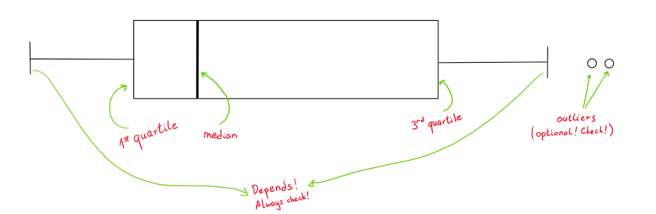

## Box plots 

A box plot, or box-and-whiskers plot, is a graphical summary of all the observations
of a single numerical trait in your data. 
It's a quick way of seeing the spread (not the distribution tho!) and the 5 basic summaries:  
- minimum  
- first quartile^[25% of your observations are numerically less than this number] (25%)  
- median (second quartile, 50%)  
- third quartile (75%)   
- maximum  

```{r}
#| label: iris_2_species_box_plot

library(datasets) # for loading iris
library(ggplot2) # for plotting
suppressMessages(library(tidyverse))
data(iris)

# brief transformation so we see only two groups of Species (instead of three) 
iris %>% dplyr::filter(Species %in% c("setosa", "versicolor")) %>%
  ggplot() +
  geom_boxplot(mapping = aes(x = Species, y = Petal.Length)) 
  
```
Even without knowing what each part of a boxplot is, you can tell there seems to
be some kind of difference worth investigating further.

### When to use this?

I'd use this more for **quick comparisons** between groups with the same trait of interest.  
Do **not** over-interpret, there is no statistical test here claiming 
these 2+ groups are statistically different from each other! More on that in [Statistical Tests TBA](). There are *notched*  box plots that somewhat coincide with
95% CIs for medians, but you would need to test for a difference between medians regardless.  
***Caveats:***   
- Box plots also hide info like distribution and sample size. If I would like to see the **distribution**, I find violin plots^[to be a link soon] more useful. **Sample size** could be seen with adding each data point with e.g. jitter.  
- If you feel strongly about about how the median or quartiles are calculated, be wary!
Check how the box plot is calculating it (R has 9 types of
quantile calculations, see [here](https://www.rdocumentation.org/packages/stats/versions/3.6.2/topics/quantile)). With a larger^[In practice, larger should be n>30, but take that
with a grain of salt] number observations, they converge, but on smaller datasets you can
see a difference.

### Interpreting a box plot
Now let's look at the details of a box plot.



The box starts and ends (called hinges) with the $1^{st}$ and $3^{rd}$ quartile, with the median 
denoted inside the box. The length of the box is called the interquartile range and 
is commonly abbreviated as IQR. It's calculated as $3^{rd} quartile-1^{st} quartile$.  
The boxplot function you are working with determines how long the whiskers will be. **Check the docs for your function of interest!** Above I used `ggplot2::geom_boxplot` that states:

> The upper whisker extends from the hinge to the largest value no further than 1.5 * IQR from the hinge (where IQR is the inter-quartile range, or distance between the first and third quartiles). The lower whisker extends from the hinge to the smallest value at most 1.5 * IQR of the hinge. Data beyond the end of the whiskers are called "outlying" points and are plotted individually.


So for `ggplot2::geom_boxplot`, the right whisker extends to the last datapoint 
that is **no further** than 1.5 * IQR from the right hinge, and outliers are considered 
everything greater. Analogous for the left whisker.   
Other box plot functions could e.g. just extend the whiskers to the min and max 
datapoints, meaning there are no outliers in that scenario.

On real data:

```{r}
#| label: iris_example_box_plot

setosas <- iris %>% dplyr::filter(Species %in% c("setosa")) %>%
                    dplyr::mutate(point_type = "data_point")

five_quantiles <- quantile(setosas$Petal.Length)

quartiles <- five_quantiles[c("25%", "50%", "75%")]

IQR <- quartiles[["75%"]] - quartiles[["25%"]] 

# the numbers that are compared to data points to determine whisker ends
fences <- c(quartiles[["25%"]] - 1.5*IQR, quartiles[["75%"]] + 1.5*IQR)

summaries_to_overlay <- data.frame(
  Species = "setosa",
  Petal.Length = c(quartiles, fences),
  point_type = c(rep("quartile", length(quartiles)),
                 rep("whisker_ends", length(fences))
                 )
)

point_type_colours <- c("data_point"   = "orange", 
                        "quartile"     = "red", 
                        "whisker_ends" = "green")

point_type_labels <- c("data_point"   = "Data points", 
                       "quartile"     = "Quartiles (Q1-3)", 
                       "whisker_ends" = "Hinges +/- 1.5*IQR")

point_type_shapes <- c("data_point"     = 16, #"dot", 
                        "quartile"     = 15, # "square", 
                        "whisker_ends" = 18 #"diamond"
                       )

ggplot(data = setosas, 
       mapping = aes(x = Petal.Length, 
                     y = Species)) +
  geom_boxplot() +
  # each individual data point will be seen by only jittering vertically, 
  # not horizontally thanks to width = 0
  geom_jitter(mapping = aes(color = point_type,
                            shape = point_type), 
              size=1, alpha=0.9, width = 0) +
  # quartiles are red squares
  # the +/- 1.5*IQR are green diamonds, making it easier to see why some are
  # outliers, and which datapoints have been "chosen" for whisker endings
  geom_point(data = summaries_to_overlay, 
             mapping = aes(x = Petal.Length, 
                           y = Species, 
                           color = point_type,
                           shape = point_type), 
             size = 4) + 
  labs(color = "Legend",
       shape = "Legend") +
  scale_color_manual(values = point_type_colours,
                     labels = point_type_labels) +
  scale_shape_manual(values = point_type_shapes,
                     labels = point_type_labels)

  
```


